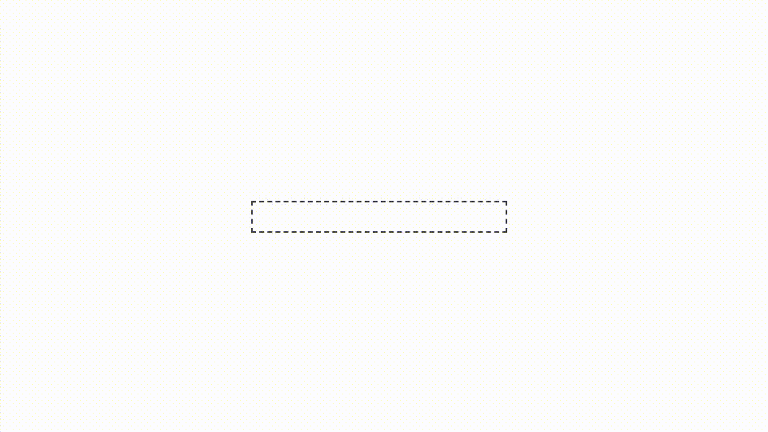

# Cap-VMarquee-Nuxt3

`Cap VMarquee Nuxt3` is Marquee component similar to Deprecated marquee html tag for [**Nuxt 3 FrameWork**](https://nuxt.com/).

[![npm version][npm-version-src]][npm-version-href]
[![npm downloads][npm-downloads-src]][npm-downloads-href]
[![License][license-src]][license-href]
[![Nuxt][nuxt-src]][nuxt-href]


<!-- Badges -->

[npm-version-src]: https://img.shields.io/npm/v/my-module/latest.svg?style=flat&colorA=020420&colorB=00DC82

[npm-version-href]: https://npmjs.com/package/my-module

[npm-downloads-src]: https://img.shields.io/npm/dm/my-module.svg?style=flat&colorA=020420&colorB=00DC82

[npm-downloads-href]: https://npm.chart.dev/my-module

[license-src]: https://img.shields.io/npm/l/my-module.svg?style=flat&colorA=020420&colorB=00DC82

[license-href]: https://npmjs.com/package/my-module

[nuxt-src]: https://img.shields.io/badge/Nuxt-020420?logo=nuxt.js

[nuxt-href]: https://nuxt.com


## About

The `Cap VMarquee Nuxt3` is an open-source library developed and maintained by [**CAP Company**](https://i-cap.ir).
It is developed using `Nuxt 3` framework and `tailwindcss`.

## Showcase

<p align="center"></p>

## Quick Setup

1. Add `Cap-VMarquee-Nuxt3` dependency to your project .

### Using yarn :

```bash
yarn add Cap-VMarquee-Nuxt3
```

### Using npm :

```bash
npm install Cap-VMarquee-Nuxt3
```

### Using pnpm :

```bash
pnpm add Cap-VMarquee-Nuxt3
```

1. Add `cap-vmarquee-nuxt3` to the `modules` of `nuxt.config.ts`

```ts
export default defineNuxtConfig({
  modules: ['cap-vmarquee-nuxt3']
});
```

That's it! You can now use library in your Nuxt app ✨

## How to Use

Using the marquee is easy, you just need to import the library and use it as follows.

```js
<VMarquee/>
```

## Props

| **Key**          | **Type**           | **Default** | **Description**                                  | sample |
|------------------|--------------------|------------|--------------------------------------------------|--------|
| `duration`       | `string \| number` | 3           | defines how long an animation takes to complete  | 2      |
| `delay`          | `string \| number` | 0          | sets the time before an animation starts.        | 1      |
| `direction`      | `TDirection`       | normal     | specifies the direction the animation will play. | normal |
| `timingFunction` | `TTimingFunction`  | linear     | controls the speed curve of an animation.        | linear |

## Types
```ts
type TDirection = "normal" | "reverse"

type TTimingFunction = "ease" | "linear" | "ease-in" | "ease-out" | "ease-in-out"
```

## Full Sample Code

```vue
<VMarquee
  :duration="5"
  :delay="0"
  direction="normal"
  timing-function="ease-in-out"
>
  <h1>Mohammad Rouhani</h1>
</VMarquee>
```

## Thank You

Thanks to all colleagues of [CAP Company](https://i-cap.ir)

Author : [Mohammad Rouhani](mailto:m.rouahni2001@gmail.com)

#### Thank you my Colleague:

https://github.com/Ghanavati7915
